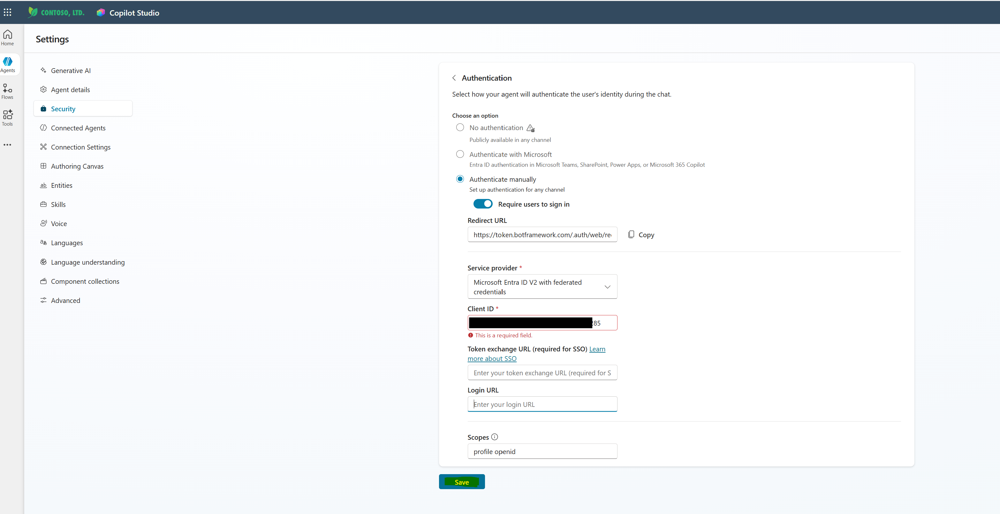
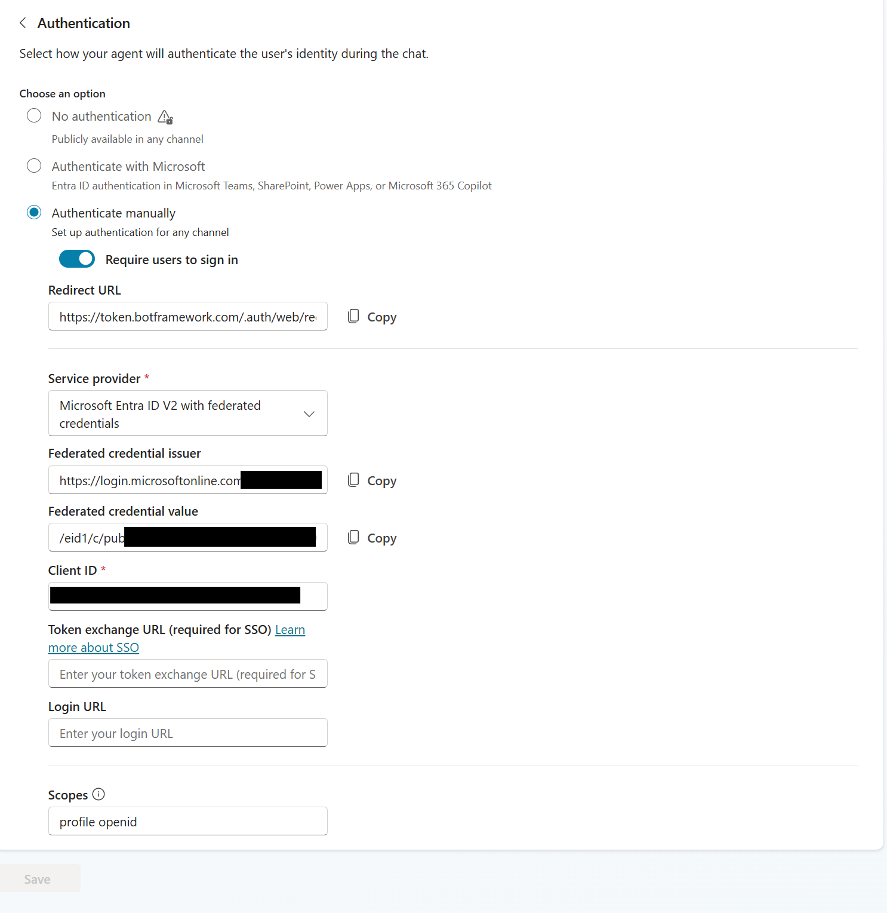
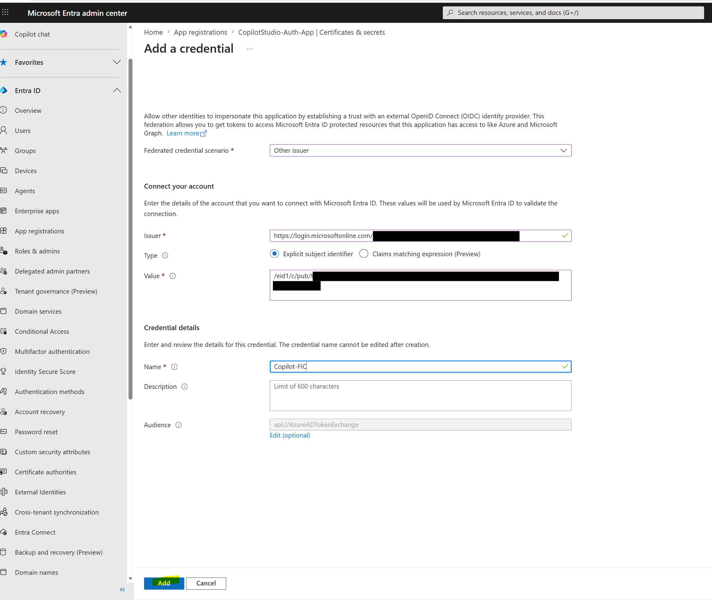
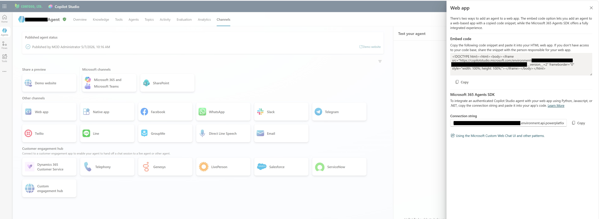

# Quick Start: Real Working Path

This is the shortest path to reproduce the working implementation documented in [README.md](README.md).

## Scope

- Copilot Studio agent
- SharePoint Online grounding via Microsoft Graph
- Internal and B2B guest access
- Manual authentication with Microsoft Entra ID v2 federated credentials
- Web app deployment using embed code

## Important Constraint

For this scenario, use manual authentication.

Do not implement SSO for this guest plus SharePoint grounding path.

Reference:

- https://learn.microsoft.com/en-us/microsoft-copilot-studio/knowledge-add-sharepoint#advanced-authentication-scenarios

## 11-Step Runbook

1. Prepare SharePoint knowledge source and grant user access.
2. Create Copilot Studio agent and add SharePoint knowledge.
3. Create single-tenant Entra app registration.
4. Add web redirect URI: https://token.botframework.com/.auth/web/redirect.
5. Add delegated Graph permissions and grant admin consent:
   - openid
   - profile
   - User.Read
   - Sites.Read.All
   - Files.Read.All
6. Copy Application (client) ID from Entra app registration.
7. Set Authentication to Authenticate manually in Copilot Studio and enter Client ID before saving.
8. Copy federated credential issuer and value from Copilot Studio (after save).
9. Add federated credential (Other issuer) in Entra app registration.
10. Share agent with internal and guest users (or security group).
11. Publish agent and deploy in Web channel using iframe embed.

## Where People Usually Get Stuck

### 1) Client ID Required Before Save (Step 7)

If Copilot Studio asks for Client ID before it lets you save manual auth:

1. Open Entra admin center first.
2. Create the app registration.
3. Copy Application (client) ID from app Overview.
4. Return to Copilot Studio Authentication and paste Client ID.
5. Save.

### 2) Copilot Studio Federated Values (Step 8)

If you cannot find the issuer/value fields:

1. Open your agent in Copilot Studio.
2. Go to Settings → Security → Authentication.
3. Enter Client ID and save first.
4. Scroll in the same screen and copy both federated values.

### 3) Entra Federated Credential Form (Step 9)

If you do not know where to paste those values:

1. Open Entra admin center.
2. Go to App registrations → your app → Certificates and secrets.
3. Open Federated credentials → Add credential.
4. Select Other issuer and paste issuer + subject/value.

### 4) Web Channel Embed Code (Step 11)

If you cannot find the iframe code:

1. In Copilot Studio open Channels.
2. Select Web app.
3. Copy the embed snippet shown in that panel.

## Validation

Test both user types in private/incognito browser sessions:

- Internal user
- Guest user

Expected behavior:

- User has SharePoint access: content returned
- User has no SharePoint access: no content returned

## Open Full Guide

- Full implementation details: [README.md](README.md)
- Deep-dive docs: [docs](docs)
