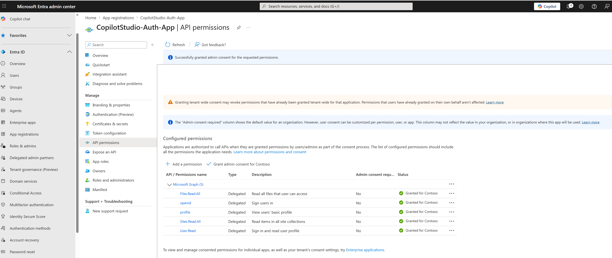
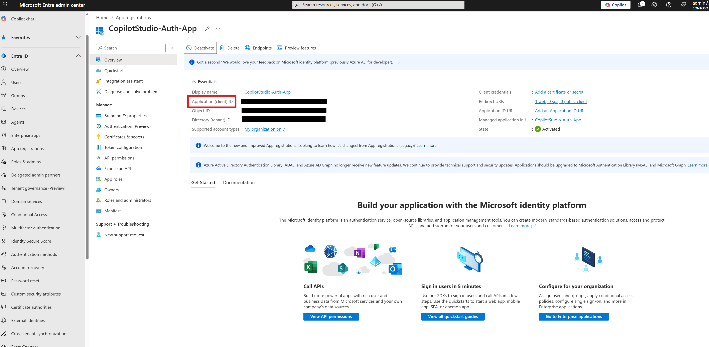

# Copilot Studio Agent (Web App) with Entra ID Authentication + SharePoint Grounding + B2B Guests

This guide documents a real end-to-end implementation of a Copilot Studio agent deployed as a web app, supporting:

- Internal users
- B2B guest users
- SharePoint Online as knowledge source (Graph grounding)
- Microsoft Entra ID manual authentication

The steps below are based on a working implementation.

## Scenario

Goal:

1. Build a Copilot Studio agent grounded on a SharePoint site.
2. Allow both internal and guest users to access it.
3. Enforce secure sign-in with Microsoft Entra ID.
4. Deploy it as a web app with embed code.

## Key Design Decisions

- Authentication method: Manual authentication
- Identity provider: Microsoft Entra ID v2 with federated credentials
- Access model: Delegated (user-based SharePoint access)
- Deployment model: Copilot Studio web channel (iframe embed)

## Known Limitation

This implementation intentionally does not use SSO.

For this scenario, SSO can break SharePoint/Graph grounding for guest users.

Therefore:

- Manual authentication is required
- Guest users can work with SharePoint grounding
- SSO is not used in this implementation

References:

- https://learn.microsoft.com/en-us/microsoft-copilot-studio/knowledge-add-sharepoint#advanced-authentication-scenarios
- https://learn.microsoft.com/en-us/microsoft-copilot-studio/configure-sso

## Architecture

```text
User (Internal / Guest)
   ↓
Web App (Embed)
   ↓
Copilot Studio Agent
   ↓
Entra ID (Manual Auth)
   ↓
Microsoft Graph (Delegated)
   ↓
SharePoint Online
```

## Step-by-Step Implementation

### Step 1: Prepare SharePoint Knowledge Source

- Identify the SharePoint site used as knowledge source.
- Add internal and guest users (B2B) to the SharePoint site.
- Assign needed permissions (View, Read, or Edit).

Important:

SharePoint access is enforced at runtime. Users must already have access to retrieve content.

### Step 2: Create the Copilot Studio Agent

In Copilot Studio:

- Create a new agent
- Configure name, description, and instructions
- Add SharePoint site as knowledge source

### Step 3: Create App Registration

In Entra:

Entra ID → App registrations → New registration

Configuration:

- Name: CopilotStudio-Auth-App (or your preferred name)
- Supported account types: Accounts in this organizational directory only (single tenant)

Register.


### Step 4: Configure Redirect URI and Graph Permissions in Entra

Path:

Authentication → Add platform → Web

Add redirect URI:

https://token.botframework.com/.auth/web/redirect

Enable:

- Access tokens
- ID tokens

Then configure Graph delegated permissions:

API permissions → Add permission → Microsoft Graph → Delegated

Add:

- openid
- profile
- User.Read
- Sites.Read.All
- Files.Read.All

Important:

Grant admin consent. Without this, SharePoint grounding fails.




### Step 5: Copy Client ID from App Registration

From app overview, copy:

- Application (client) ID

You will use this immediately in Copilot Studio authentication settings.



### Step 6: Configure Authentication in Copilot Studio

Path:

Settings → Security → Authentication

Where to click:

1. Open the target agent in Copilot Studio.
2. In the left navigation, open **Settings**.
3. Select **Security**.
4. Select **Authentication**.

Change:

- From: Authenticate with Microsoft
- To: Authenticate manually

Configure:

- Service provider: Microsoft Entra ID v2 with federated credentials
- Require users to sign in: On
- Scopes: profile openid
- Client ID: Application (client) ID from Entra app registration

Save.


### Step 7: Copy Federated Credential Values

After saving authentication settings, copy:

- Federated credential issuer
- Federated credential value

These values are required for app registration setup.

Where to find them:

1. Stay on the same **Authentication** page in Copilot Studio.
2. Scroll to the federated credentials section shown after saving manual auth.
3. Copy both values exactly as shown.
4. Paste them temporarily into a secure scratch note so you can reuse them in Entra ID.


### Step 8: Configure Federated Credentials in Entra

Path:

Certificates and secrets → Federated credentials

Add credential:

- Type: Other issuer
- Issuer: Paste value from Copilot Studio
- Subject/Value: Paste value from Copilot Studio
- Name: Copilot-FIC (or your preferred name)

Save.


### Step 9: Share the Agent

Path:

Copilot Studio → Share

Add:

- Internal users
- Guest users
- Or a security group

Important:

If a user is not shared on the agent, they cannot use it.

Environment access clarification:

In this implementation, no explicit Power Platform/Dataverse environment permissions were configured.

What was sufficient:

- Agent shared from Copilot Studio
- User authenticates successfully

Meaning:

Agent access was controlled by agent sharing in Copilot Studio, not explicit environment roles.


### Step 10: Publish the Agent

After changes, publish the agent.

### Step 11: Deploy Web App

Path:

Channels → Web app

Copy embed code and use in HTML:

```html
<iframe src="your-copilot-url"></iframe>
```

Used locally for testing.


## Testing

Validated with:

- Internal user
- Guest user

Recommended test mode:

- Incognito/private browser window

## Security Model

This setup uses delegated permissions.

The agent acts on behalf of the signed-in user.

Outcome:

- User has SharePoint access: returns data
- User has no SharePoint access: no data returned

For authentication troubleshooting, verify issuer and value match exactly.

## Production Considerations

### Governance

Power Platform DLP policies may block:

- External publishing
- Connector access

### Licensing

External usage consumes Copilot credits.

Recommended:

- Capacity pack
- Pay-as-you-go (PAYG)

## Documentation Used

- https://learn.microsoft.com/en-us/microsoft-copilot-studio/knowledge-add-sharepoint#advanced-authentication-scenarios
- https://learn.microsoft.com/en-us/microsoft-copilot-studio/configuration-end-user-authentication#authenticate-manually
- https://learn.microsoft.com/en-us/microsoft-copilot-studio/configuration-authentication-azure-ad?tabs=fic-auth

## Repro Checklist

- Guest user added to tenant
- SharePoint permissions granted
- Agent created
- SharePoint added as knowledge source
- Manual authentication configured
- Federated credentials created
- App registration created
- Redirect URI configured
- Graph permissions added
- Admin consent granted
- Agent shared
- Agent published
- Web embed configured
- Tested with internal and guest users

## Lessons Learned

- Manual authentication is required for this guest plus SharePoint grounding scenario.
- Graph permissions and admin consent are critical.
- Agent sharing is the main access control in this implementation.
- Federated credentials must match exactly.
- SSO was intentionally avoided for this scenario.

## Repository Structure

- Main implementation guide: [README.md](README.md)
- Quick start summary: [QUICKSTART.md](QUICKSTART.md)
- Deep dive docs:
   - [docs/ENTRA_ID_SETUP.md](docs/ENTRA_ID_SETUP.md)
  - [docs/SHAREPOINT_SETUP.md](docs/SHAREPOINT_SETUP.md)
  - [docs/COPILOT_STUDIO_SETUP.md](docs/COPILOT_STUDIO_SETUP.md)
  - [docs/TESTING_GUIDE.md](docs/TESTING_GUIDE.md)
  - [docs/TROUBLESHOOTING.md](docs/TROUBLESHOOTING.md)

