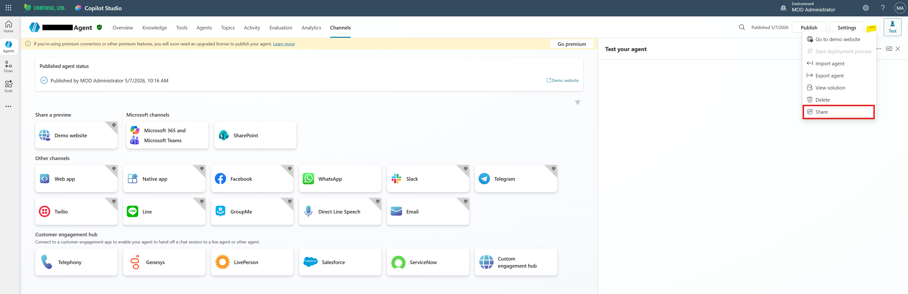

# Copilot Studio Setup (Exact Working Path)

This document captures the exact Copilot Studio configuration used in a working implementation for:

- Internal users
- B2B guest users
- SharePoint grounding
- Manual authentication with Entra ID v2 federated credentials

## Preconditions

Before this section:

- SharePoint site is ready
- Internal and guest users already have SharePoint access
- Guest users were invited and accepted in tenant
- Entra app registration already exists and Application (client) ID is available

## Step 1: Create Agent

In Copilot Studio:

1. Create new agent.
2. Set name, description, and instructions.
3. Save.

## Step 2: Add SharePoint as Knowledge Source

1. Open agent settings for knowledge.
2. Add SharePoint source.
3. Select the target site/library.
4. Save.

Note:

Knowledge retrieval is user-contextual. Returned content depends on each signed-in user's SharePoint permissions.

## Step 3: Switch to Manual Authentication

Path:

Settings → Security → Authentication

Set:

- Authenticate manually
- Provider: Microsoft Entra ID v2 with federated credentials
- Require users to sign in: On
- Scopes: profile openid
- Client ID: paste Application (client) ID from Entra app registration

Save.

Where to click:

1. Open the agent.
2. In left navigation, open Settings.
3. Select Security.
4. Select Authentication.
5. Change to Authenticate manually.
6. Paste the Entra Application (client) ID.
7. Save.


## Step 4: Copy Federated Credential Values

After saving manual authentication, copy:

- Federated credential issuer
- Federated credential value (subject)

You will use them in Entra app registration.

Where to find them:

1. Stay on the Authentication page after saving.
2. Locate the federated credential section rendered on that page.
3. Copy Issuer and Value exactly.


## Step 5: Create Federated Credential in Entra

After Step 4 in Copilot Studio:

1. Open Entra app registration.
2. Go to Certificates and secrets → Federated credentials.
3. Add credential with Other issuer.
4. Paste Issuer and Value copied from Copilot Studio.
5. Save.

## Step 6: Share Agent

Path:

Copilot Studio → Share

Share with:

- Internal users
- Guest users
- Or security group

Important:

If user is not shared on the agent, user cannot run the agent.



## Step 7: Publish Agent

Publish after authentication and sharing changes.

## Step 8: Deploy to Web Channel

1. Open Channels → Web app.
2. Copy embed code.
3. Embed in HTML page:

```html
<iframe src="your-copilot-url"></iframe>
```


## Validation

Test in incognito/private browser sessions:

- Internal user
- Guest user

Expected:

- User with SharePoint access gets grounded answers
- User without SharePoint access does not receive that content

## Important Limitation

For this scenario, manual authentication was required.

SSO was intentionally not used for guest plus SharePoint grounding.

Reference:

- https://learn.microsoft.com/en-us/microsoft-copilot-studio/knowledge-add-sharepoint#advanced-authentication-scenarios
