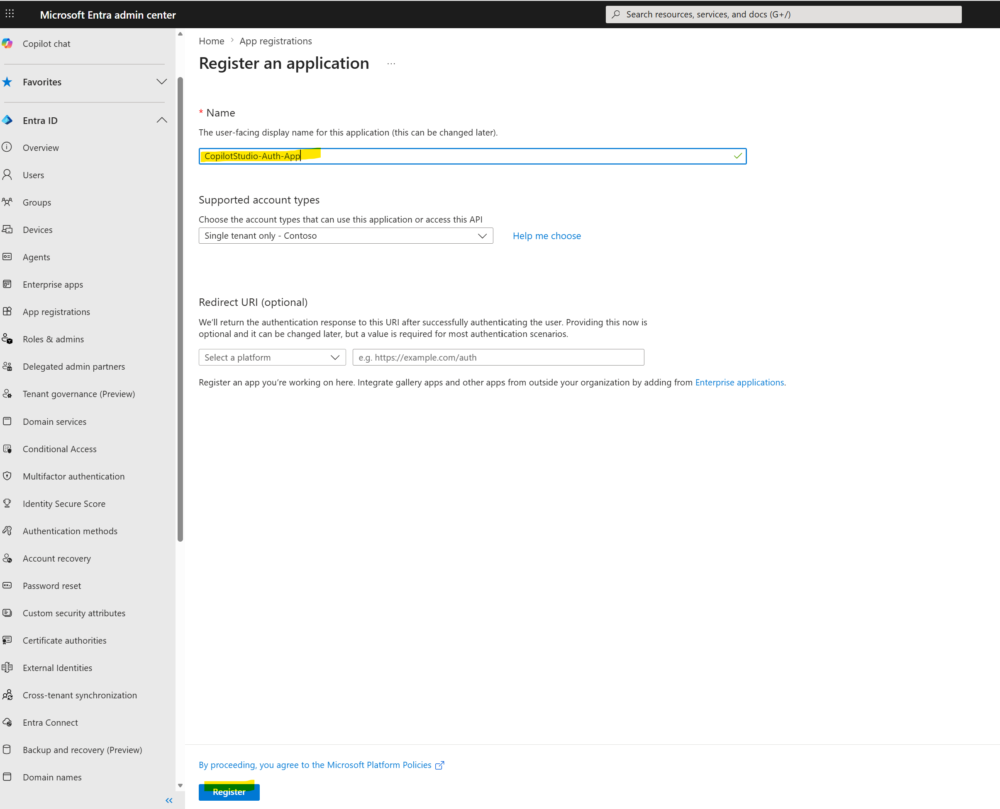
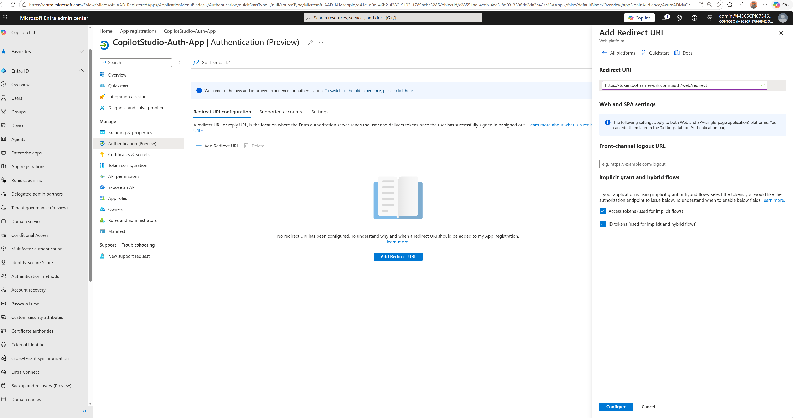

# Entra ID Setup (Exact Working Path)

This document captures the exact Entra configuration used for Copilot Studio manual authentication with federated credentials.

## Scope

- Single-tenant app registration
- Delegated Graph permissions for user-context SharePoint grounding
- Federated credential from Copilot Studio values (added after Copilot manual-auth save)

## Preconditions

- Guest users were invited to tenant and accepted invitation.
- SharePoint permissions were already granted to internal and guest users.
- Copilot Studio agent exists and SharePoint knowledge source is already configured.

## Step 1: Create App Registration

Path:

Entra ID → App registrations → New registration

Configuration:

- Name: CopilotStudio-Auth-App (or your naming standard)
- Supported account types: Accounts in this organizational directory only (single tenant)

Create app.

## Step 2: Configure Redirect URI

Path:

Authentication → Add platform → Web

Add redirect URI:

https://token.botframework.com/.auth/web/redirect

Enable tokens:

- Access tokens
- ID tokens

Save.

## Step 3: Add Microsoft Graph Delegated Permissions

Path:

API permissions → Add permission → Microsoft Graph → Delegated permissions

Add:

- openid
- profile
- User.Read
- Sites.Read.All
- Files.Read.All

Then click Grant admin consent.

Important:

Without admin consent, SharePoint grounding can fail.

## Step 4: Capture Client ID

From app overview, copy Application (client) ID.

Use this value in Copilot Studio authentication settings before clicking Save.

## Step 5: Add Federated Credential (After Copilot Save)

Path:

Certificates and secrets → Federated credentials → Add credential

Configuration:

- Scenario: Other issuer
- Issuer: value copied from Copilot Studio Authentication page
- Subject/value: value copied from Copilot Studio Authentication page
- Name: Copilot-FIC (or your naming standard)

Save.

Order requirement:

1. In Copilot Studio, set manual auth and enter Client ID.
2. Save so Issuer and Value are generated.
3. Return here and create the federated credential.

Field mapping tip:

- Issuer in Copilot Studio maps to Issuer in Entra.
- Federated credential value in Copilot Studio maps to Subject identifier/value in Entra.
- Copy/paste directly to avoid hidden character mismatches.

## Validation

- App registration exists and is single-tenant.
- Redirect URI matches exactly.
- Delegated Graph permissions are present.
- Admin consent is granted.
- Client ID was used in Copilot Studio before manual-auth save.
- Federated credential issuer and subject match Copilot Studio output.

## Notes

This implementation used delegated access model.

The agent acts on behalf of the signed-in user, and SharePoint permission boundaries are preserved at runtime.
